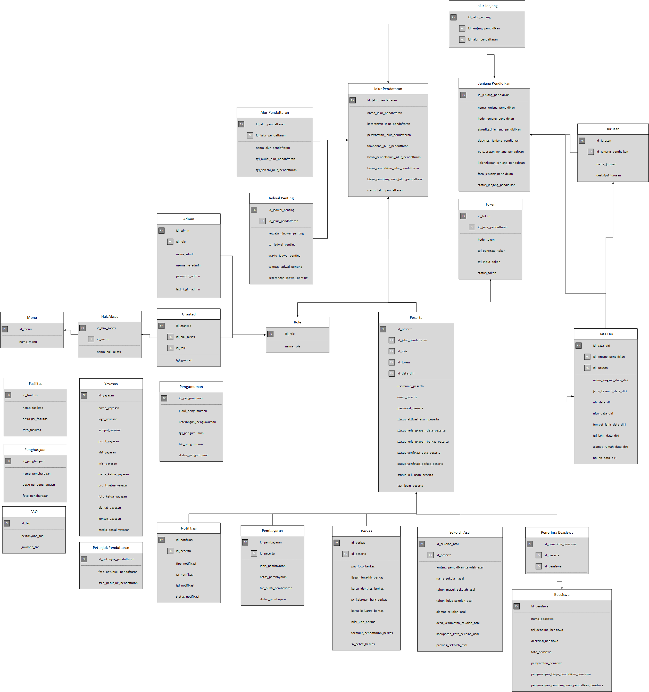

# PPDB BARAMIJ
 
## Pendahuluan
i-PPDB merupakan aplikasi pengelolaan Penerimaan Peserta Didik Baru (PPDB) untuk yayasan pendidikan yang melingkupi banyak sekolah mulai dari TK hingga SMA sederajat. i-PPDB mendukung integrasi proses PPDB seluruh sekolah dalam satu yayasan yang sama sehingga pihak yayasan dapat memantau sekaligus mengelola pendaftaran secara keseluruhan. Pengelolaan PPDB juga dapat dilakukan masing-masing pihak sekolah seperti melakukan verifikasi data, kelola kelulusan, hingga registrasi ulang.

## Fitur
1. Sistem Pendaftaran Online
2. Sistem Aktivasi Akun
3. Verifikasi Data dan Berkas Pendaftar
4. Statistik Pendaftaran Siswa Baru
5. Manajemen Peserta Pendaftaran
6. Manajemen Kelulusan
7. Manajemen Admin
8. Manajemen Yayasan dan Sekolah
9. Manajemen Pengumuman dan Informasi Pendaftaran

## Proses Bisnis
 

## Preview
*Tampilan depan i-PPDB*
 

*Tampilan dashboard peserta*
 

*Tampilan dashboard admin*
 

## Skema Relasi
 

